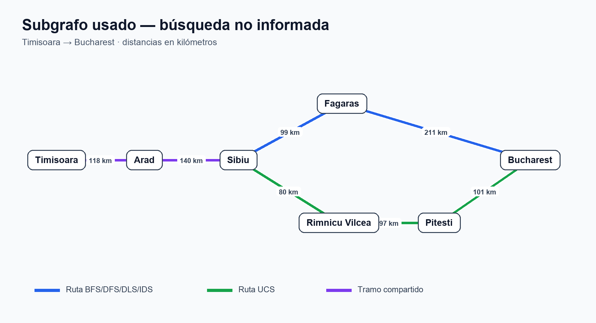
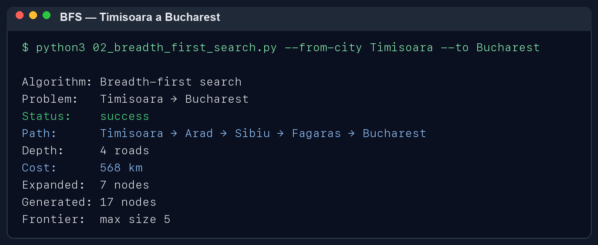
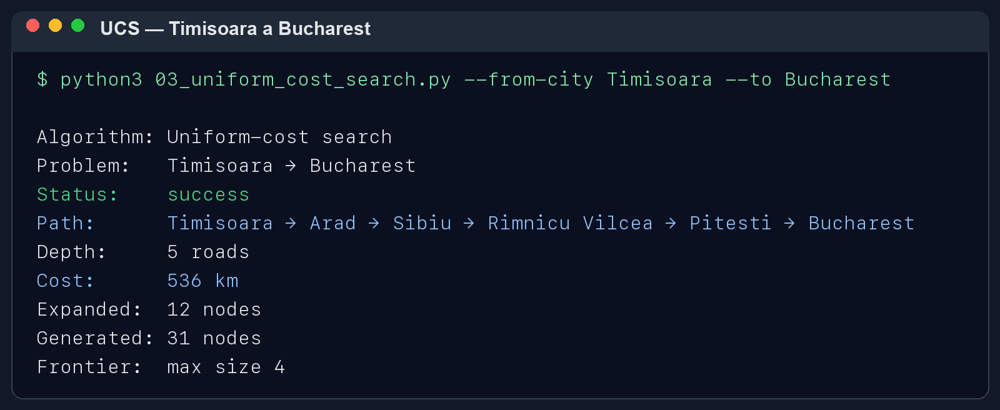
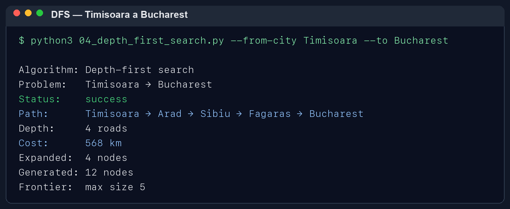
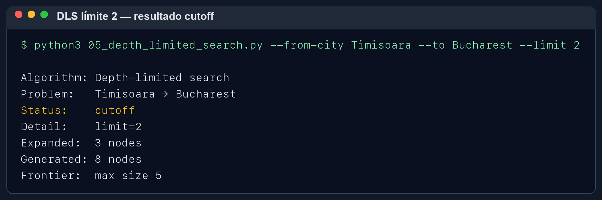
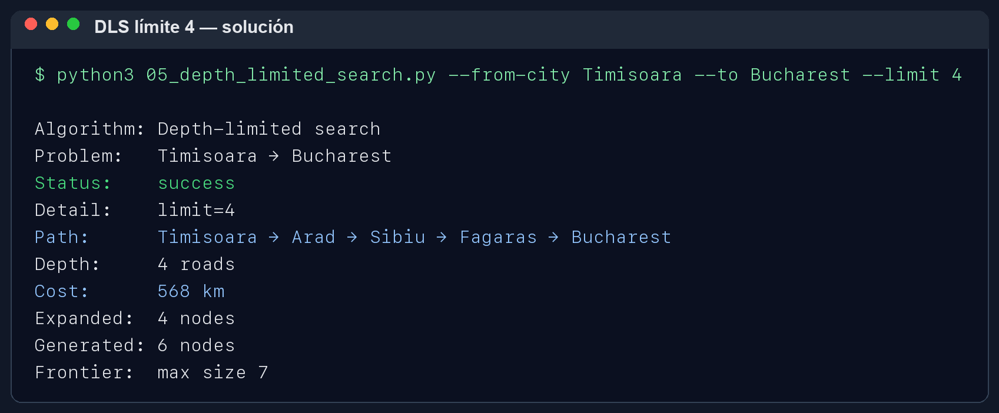
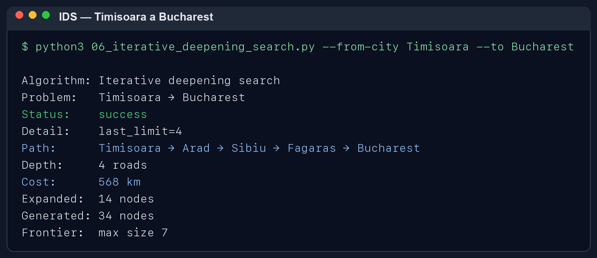

# Ejercicio 1 — Comparar búsquedas no informadas

> Los resultados se obtuvieron ejecutando los programas del repositorio. Las evidencias están incluidas como imágenes PNG.

## Pareja elegida

Usé Timisoara como origen y Bucharest como destino. Es una pareja distinta de Arad a Bucharest, que es el ejemplo que viene por defecto.

## Resultados

| Método | Ruta | Carreteras | Km | Nodos expandidos | Estado |
|---|---|---:|---:|---:|---|
| BFS | Timisoara → Arad → Sibiu → Fagaras → Bucharest | 4 | 568 | 7 | Solución |
| UCS | Timisoara → Arad → Sibiu → Rimnicu Vilcea → Pitesti → Bucharest | 5 | 536 | 12 | Solución |
| DFS | Timisoara → Arad → Sibiu → Fagaras → Bucharest | 4 | 568 | 4 | Solución |
| DLS, límite 2 | No llegó a Bucharest | — | — | 3 | Cutoff |
| DLS, límite 4 | Timisoara → Arad → Sibiu → Fagaras → Bucharest | 4 | 568 | 4 | Solución |
| IDS, último límite 4 | Timisoara → Arad → Sibiu → Fagaras → Bucharest | 4 | 568 | 14 | Solución |

## Diagrama del subgrafo usado

Las carreteras son de ida y vuelta. El dibujo reúne los caminos que aparecieron en los resultados de los algoritmos.

## Lo que observé

BFS encontró una ruta con menos carreteras, pero no fue la de menos kilómetros. UCS recorrió una carretera más y aun así sumó menos distancia: 536 km. Esto pasa porque BFS cuenta cuántas carreteras hay, mientras que UCS toma en cuenta los kilómetros.

En esta prueba DFS encontró la misma ruta que BFS, aunque no siempre tiene que encontrar una ruta corta. DLS no llegó al destino con límite 2; con límite 4 sí encontró una solución. IDS fue probando límites y terminó encontrando una ruta de la misma profundidad que BFS.

## Ruta de cuatro carreteras

Timisoara → Arad → Sibiu → Fagaras → Bucharest

## Evidencia de ejecución

Las siguientes imágenes muestran las salidas completas obtenidas al ejecutar cada programa.

### BFS

### UCS

### DFS

### DLS con límite 2

### DLS con límite 4

### IDS

