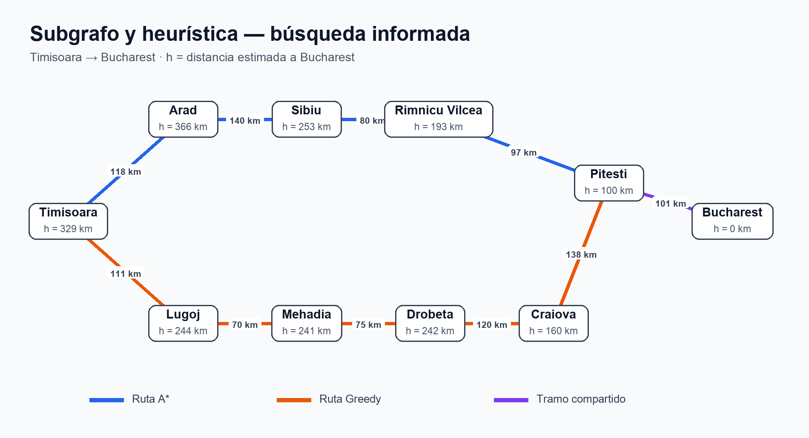
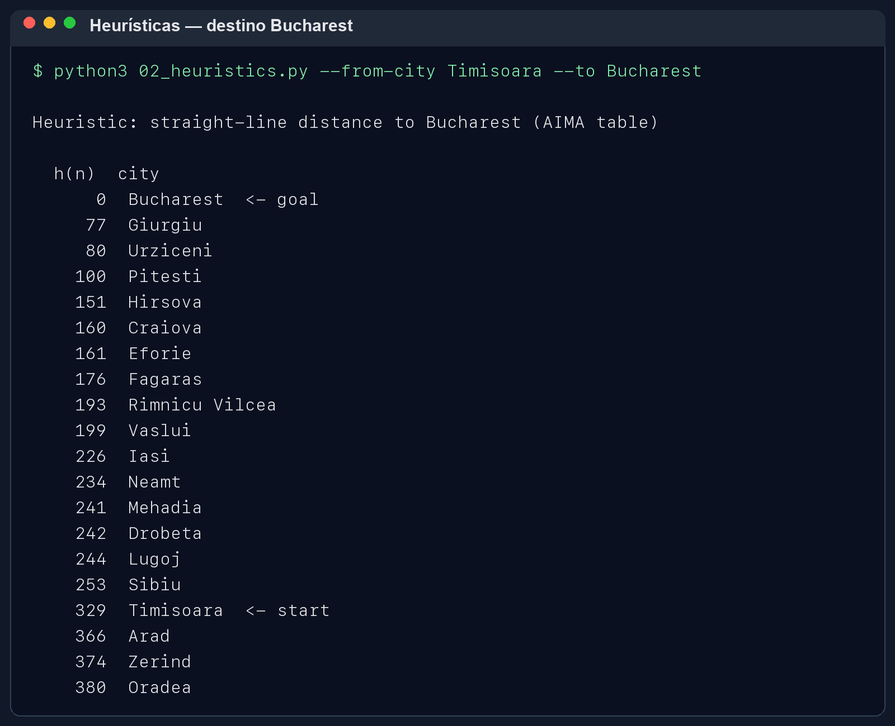
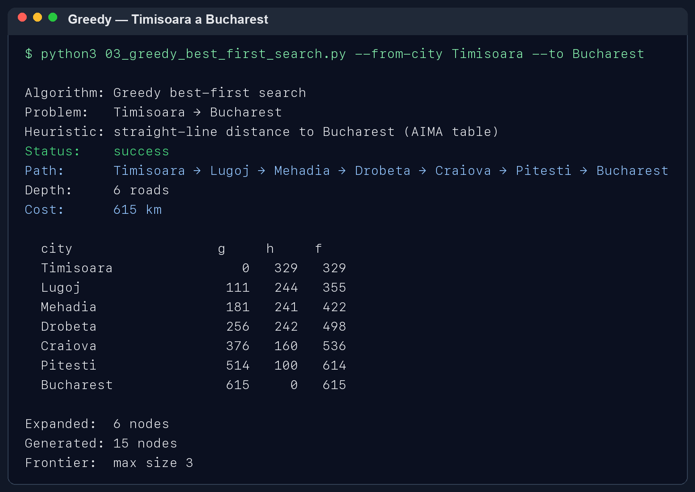
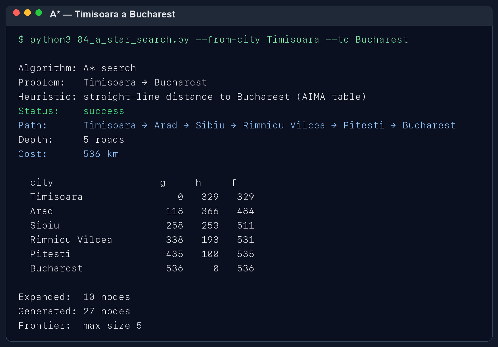

# Ejercicio 1 — Comparar Greedy y A*

> Los resultados se obtuvieron ejecutando los programas del repositorio. Las evidencias están incluidas como imágenes PNG.

## Pareja elegida

Usé Timisoara como origen y Bucharest como destino. Los dos programas usaron la estimación de distancia en línea recta hacia Bucharest que trae el proyecto.

## Resultados

| Método | Ruta | Carreteras | Km | Nodos expandidos |
|---|---|---:|---:|---:|
| Greedy | Timisoara → Lugoj → Mehadia → Drobeta → Craiova → Pitesti → Bucharest | 6 | 615 | 6 |
| A* | Timisoara → Arad → Sibiu → Rimnicu Vilcea → Pitesti → Bucharest | 5 | 536 | 10 |

Heurística usada por los dos: distancia en línea recta estimada hacia Bucharest.

## Diagrama del subgrafo y estimaciones

El dibujo reúne las carreteras usadas por Greedy y A*. Los valores de `h` son la distancia estimada en línea recta hasta Bucharest.

| Ciudad | h hacia Bucharest |
|---|---:|
| Timisoara | 329 km |
| Arad | 366 km |
| Sibiu | 253 km |
| Rimnicu Vilcea | 193 km |
| Pitesti | 100 km |
| Lugoj | 244 km |
| Mehadia | 241 km |
| Drobeta | 242 km |
| Craiova | 160 km |
| Bucharest | 0 km |

## Lo que observé

Greedy fue el que expandió menos nodos en esta prueba, pero eligió una ruta más larga y de más kilómetros. Al inicio prefirió Lugoj porque su distancia estimada a Bucharest era menor que la de Arad (244 km frente a 366 km). Greedy se guía por esa cercanía estimada y no toma tanto en cuenta lo que ya recorrió.

A* suma lo recorrido y lo que calcula que falta. Al inicio también explora Lugoj: su valor es 355 km (111 + 244), frente a 484 km para Arad (118 + 366). Después compara otras rutas y termina con el camino por Arad y Sibiu, que suma 536 km. Revisó más opciones que Greedy, pero su ruta fue 79 km más corta.

## Rutas obtenidas

Greedy: Timisoara → Lugoj → Mehadia → Drobeta → Craiova → Pitesti → Bucharest

A*: Timisoara → Arad → Sibiu → Rimnicu Vilcea → Pitesti → Bucharest

## Evidencia de ejecución

Las siguientes imágenes muestran el listado de heurísticas y las salidas completas de Greedy y A*.

### Heurística hacia Bucharest

### Greedy

### A*

